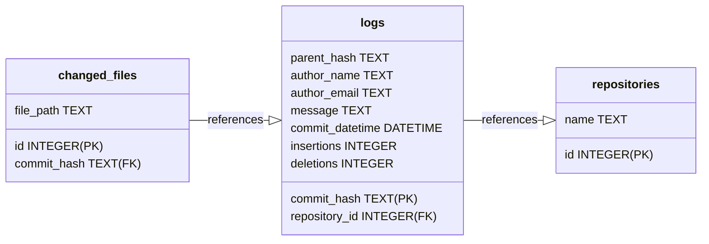

# git-log-to-sqlite

A tool to convert git repository logs (without merge commit) to a sqlite database.

## Installation

```
$ cargo install --git https://github.com/0x6b/git-log-to-sqlite
```

## Usage

```console
$ git-log-to-sqlite -h
A tool to convert git repository logs (without merge commit) to sqlite database

Usage: git-log-to-sqlite [OPTIONS] <ROOT>

Arguments:
  <ROOT>  Path to the root directory to scan

Options:
  -r, --recursive                  Recursively scan the root directory
  -m, --max-depth <MAX_DEPTH>      Max depth of the recursive scan [default: 1]
  -d, --database <DATABASE>        Path to the database [default: repositories.db]
  -f, --config <CONFIG>            Path to JSON configuration file [default: config.json]
  -c, --clear                      Delete all records from the database before scanning
  -n, --num-threads <NUM_THREADS>  Number of worker threads [default: 8]
  -h, --help                       Print help
  -V, --version                    Print version
```

### Configuration

By default, the tool will look for a file named `config.toml` in the current directory. All the configurations are optional.

- `ignored_repositories`: You can ignore some directories by adding their names to this list.
- `author_map`: You can override the author names by adding their emails to this map, to normalize the author names.

```toml
"ignored_repositories" = [
    "directory-name-of-repository-to-ignore",
    "..."
]

[author_map]
"email@example.com" = "Name of the author"
"..." = "..."
```

## Schema



## License

MIT. See [LICENSE](LICENSE) for details.
